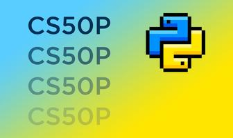
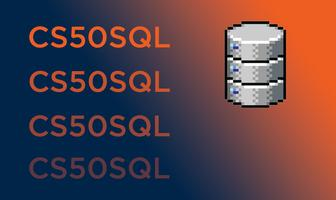

# Data Science and Analytics Portfolio

### CS50 Python
The CS50 Python course at Harvard University provides a solid introduction to the principles of the Python programming language. 

Throughout the program, essential concepts such as data manipulation, control structures, functions, and object-oriented programming are explored, laying a strong foundation for Python development.

The [practical application](https://github.com/marco-rocha97/CS50-Python) of these skills occurs through challenges and projects, allowing for the consolidation of acquired abilities.

The emphasis on hands-on practice in CS50 Python reinforces the ability to develop efficient solutions, solidifying a profound understanding of the Python language and its applications in various contexts.

### CS50 SQL
The CS50 SQL course at Harvard University provides a solid introduction to the fundamental principles of Structured Query Language (SQL) and relational database design.

Throughout the program, essential concepts are explored, such as data querying, table manipulation, establishment of relationships, aggregate functions, and indexing for performance optimization. 

Additionally, the course covers advanced topics, including triggers, stored procedures, data security, and access control. 

These skills are applied through [practical projects](https://github.com/marco-rocha97/CS50-SQL), solidifying proficiency in the analysis and efficient management of data.

